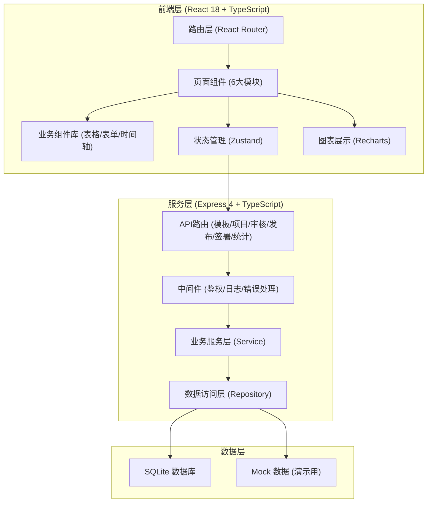
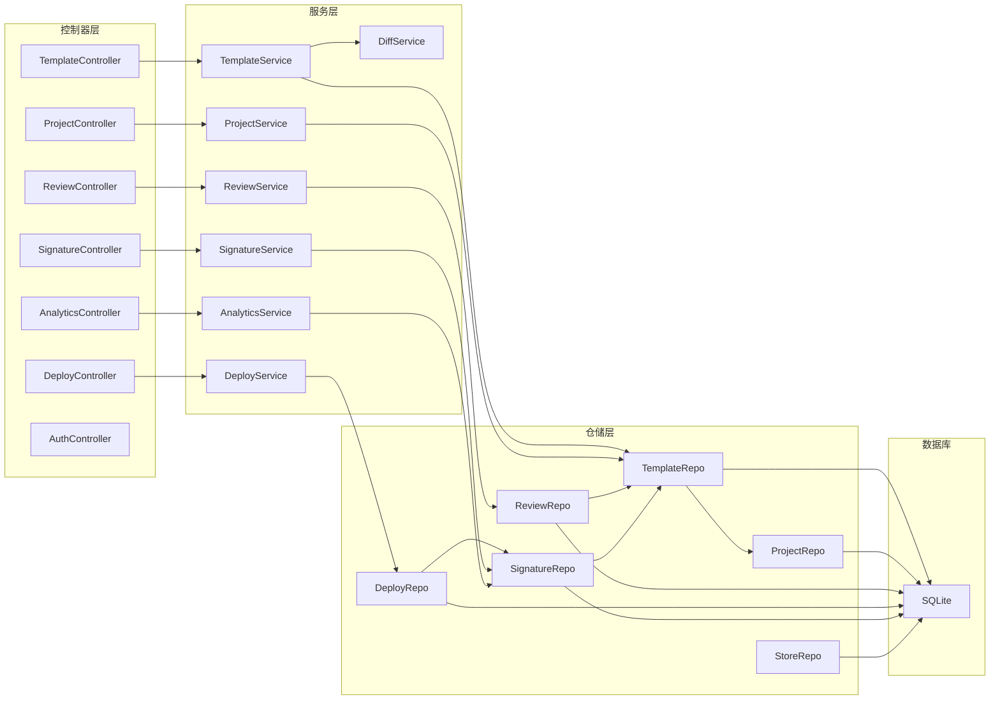
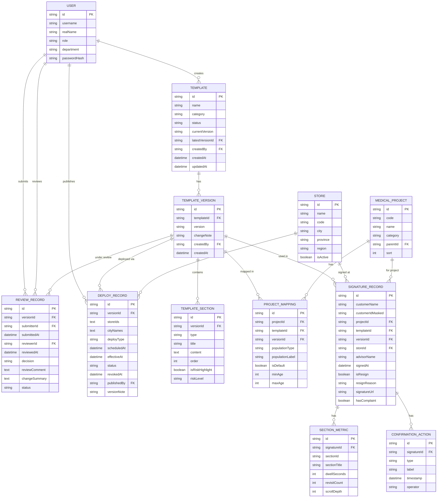

## 1. 架构设计

本项目采用前后端分离架构，前端为纯React单页应用，后端使用Express提供RESTful API服务，数据存储采用SQLite（开发演示阶段），前端状态管理使用Zustand。UI组件基于Tailwind CSS自定义设计系统，不依赖第三方组件库以确保专业合规风格的独特性。



## 2. 技术说明

- **前端**：React@18 + TypeScript + Vite + Tailwind CSS@3 + Zustand + Recharts + React Router DOM + Lucide React
- **后端**：Express@4 + TypeScript + better-sqlite3（SQLite驱动）
- **初始化工具**：vite-init 使用 react-express-ts 模板
- **数据库**：SQLite（本地文件存储，适合演示；生产可迁移至PostgreSQL）
- **数据策略**：内置完整Mock数据，首次启动自动初始化演示数据，无需额外配置

## 3. 路由定义

| 前端路由 | 页面组件 | 功能说明 |
|----------|----------|----------|
| `/` | Dashboard | 首页概览看板，展示待办事项和关键指标 |
| `/templates` | TemplateList | 模板库列表页，分类浏览模板 |
| `/templates/:id` | TemplateEditor | 模板编辑器，创建/编辑模板及段落 |
| `/projects` | ProjectMapping | 项目映射，医美项目与模板版本关联 |
| `/reviews` | ReviewList | 版本审核列表，待审核/已审核 |
| `/reviews/:id` | ReviewDetail | 版本审核详情，差异对比和审核操作 |
| `/deploy` | DeployCenter | 门店发布中心，发布范围选择和配置 |
| `/signatures` | SignatureList | 签署追踪列表，查询签署记录 |
| `/signatures/:id` | SignatureDetail | 签署详情，快照展示和导出 |
| `/analytics` | RiskAnalytics | 风险统计看板，数据图表和报表 |
| `/login` | LoginPage | 登录页，角色切换演示 |

## 4. API 定义

### 4.1 通用响应结构

```typescript
interface ApiResponse<T> {
  code: number;
  message: string;
  data: T;
  timestamp: number;
}

interface PagedData<T> {
  items: T[];
  total: number;
  page: number;
  pageSize: number;
}
```

### 4.2 模板相关API

```typescript
// 模板分类
enum TemplateCategory {
  INJECTION = 'injection',    // 注射类
  SKIN = 'skin',              // 皮肤类
  PLASTIC = 'plastic',        // 整形外科
  ANTI_AGING = 'anti_aging'   // 抗衰类
}

// 模板状态
enum TemplateStatus {
  DRAFT = 'draft',            // 草稿
  REVIEWING = 'reviewing',    // 审核中
  APPROVED = 'approved',      // 审核通过
  REJECTED = 'rejected',      // 驳回
  PUBLISHED = 'published'     // 已发布
}

// 段落类型
enum SectionType {
  INTRODUCTION = 'introduction',     // 项目介绍
  CONTRAINDICATION = 'contraindication', // 禁忌症
  ALTERNATIVE = 'alternative',       // 替代方案
  POST_CARE = 'post_care',           // 术后护理
  DISPUTE = 'dispute',               // 争议处理
  CUSTOM = 'custom'                  // 自定义
}

interface Template {
  id: string;
  name: string;
  category: TemplateCategory;
  status: TemplateStatus;
  currentVersion: string;
  latestVersionId: string;
  createdAt: string;
  updatedAt: string;
  createdBy: string;
}

interface TemplateVersion {
  id: string;
  templateId: string;
  version: string;
  changeNote: string;
  sections: TemplateSection[];
  createdAt: string;
  createdBy: string;
}

interface TemplateSection {
  id: string;
  type: SectionType;
  title: string;
  content: string;  // HTML富文本
  order: number;
  isRiskHighlight: boolean;
  riskLevel?: 'low' | 'medium' | 'high';
}

// GET /api/templates - 获取模板列表（支持分类筛选、搜索、分页）
// GET /api/templates/:id - 获取模板详情（含最新版本）
// GET /api/templates/:id/versions - 获取模板所有版本
// POST /api/templates - 创建新模板
// PUT /api/templates/:id - 更新模板基本信息
// POST /api/templates/:id/versions - 创建新版本
// POST /api/templates/:id/submit - 提交审核
```

### 4.3 项目映射API

```typescript
interface MedicalProject {
  id: string;
  code: string;
  name: string;
  category: TemplateCategory;
  parentId?: string;
  sort: number;
}

interface ProjectTemplateMapping {
  id: string;
  projectId: string;
  templateId: string;
  templateVersionId: string;
  populationType: 'adult' | 'minor' | 'secondary' | 'custom';
  populationLabel: string;
  isDefault: boolean;
  minAge?: number;
  maxAge?: number;
  requiredPriorTreatmentCount?: number;
}

// GET /api/projects - 获取项目树
// GET /api/projects/:id/mappings - 获取项目的模板映射
// PUT /api/projects/:id/mappings - 更新项目模板映射配置
```

### 4.4 版本审核API

```typescript
enum ReviewDecision {
  APPROVE = 'approve',
  REJECT = 'reject'
}

interface ReviewRecord {
  id: string;
  templateVersionId: string;
  templateId: string;
  submitterId: string;
  submitterName: string;
  submittedAt: string;
  reviewerId?: string;
  reviewerName?: string;
  reviewedAt?: string;
  decision?: ReviewDecision;
  reviewComment?: string;
  changeSummary: string;
  status: 'pending' | 'approved' | 'rejected';
}

// GET /api/reviews - 获取审核列表（按状态筛选）
// GET /api/reviews/:id - 获取审核详情（含版本差异）
// GET /api/reviews/:id/diff - 获取版本差异数据
// POST /api/reviews/:id/decision - 提交审核决策
```

### 4.5 门店发布API

```typescript
interface Store {
  id: string;
  name: string;
  code: string;
  city: string;
  province: string;
  region: 'north' | 'east' | 'south' | 'west' | 'central';
  isActive: boolean;
}

interface DeployRecord {
  id: string;
  templateVersionId: string;
  templateId: string;
  storeIds: string[];
  cityNames: string[];
  deployType: 'immediate' | 'scheduled';
  scheduledAt?: string;
  effectiveAt: string;
  status: 'active' | 'revoked';
  revokedAt?: string;
  publishedBy: string;
  versionNote: string;
  forceReadingMinutes?: number;
}

// GET /api/stores - 获取门店列表（按区域/城市筛选）
// GET /api/deploys - 获取发布记录
// POST /api/deploys - 新建发布
// POST /api/deploys/:id/revoke - 撤下发布
```

### 4.6 签署追踪API

```typescript
interface SignatureRecord {
  id: string;
  customerName: string;
  customerIdCardMasked: string;
  projectId: string;
  projectName: string;
  templateId: string;
  templateVersionId: string;
  templateVersion: string;
  storeId: string;
  storeName: string;
  advisorName: string;
  signedAt: string;
  isResign: boolean;
  resignReason?: string;
  sectionMetrics: SectionMetric[];
  confirmationActions: ConfirmationAction[];
  signatureUrl: string;
  hasComplaint: boolean;
}

interface SectionMetric {
  sectionId: string;
  sectionTitle: string;
  dwellTimeSeconds: number;
  revisitCount: number;
  scrollDepthPercent: number;
}

interface ConfirmationAction {
  id: string;
  type: 'read' | 'explain' | 'confirm' | 'sign';
  label: string;
  timestamp: string;
  operator: string;
}

// GET /api/signatures - 获取签署记录（支持多条件筛选、分页）
// GET /api/signatures/:id - 获取签署详情（含模板快照和时间轴）
// GET /api/signatures/:id/export - 导出签署档案PDF
// GET /api/signatures/export/batch - 批量导出
```

### 4.7 风险统计API

```typescript
interface RiskStats {
  totalSignatures30d: number;
  resignRate: number;
  avgReadingSeconds: number;
  complaintCount: number;
  signatureTrend: { date: string; count: number }[];
  topRiskSections: {
    sectionTitle: string;
    templateName: string;
    avgDwellSeconds: number;
    revisitCount: number;
    dropOffRate: number;
  }[];
  resignByProject: {
    projectName: string;
    totalCount: number;
    resignCount: number;
    resignRate: number;
  }[];
  complaintAnalysis: {
    projectName: string;
    templateVersion: string;
    relatedSections: string[];
    count: number;
  }[];
}

// GET /api/analytics/summary - 获取统计总览
// GET /api/analytics/sections - 条款维度详细统计
// GET /api/analytics/projects - 项目维度详细统计
// GET /api/analytics/export - 导出报表
```

## 5. 服务端架构图



## 6. 数据模型

### 6.1 ER图



### 6.2 初始化数据

系统首次启动时自动初始化以下演示数据：
- 3个用户账号：法务专员（李法务）、医务负责人（王主任）、门店院长（张院长）
- 4个模板分类：注射类、皮肤类、整形外科、抗衰类
- 每个分类2-3个示例模板，含完整段落内容和版本历史
- 12个医美项目及与模板的映射关系（含成人/未成年/二次治疗版本）
- 5条审核记录（2条待审核、2条已通过、1条已驳回）
- 20家门店分布于5个区域
- 8条发布记录
- 200条签署记录，含真实停留时长和确认动作数据
- 完整风险统计数据
