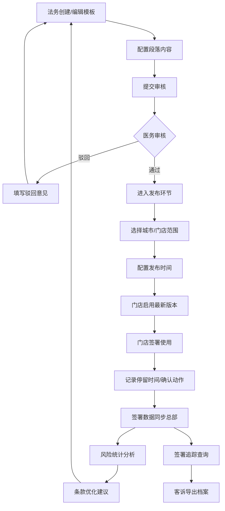

## 1. 产品概述

本产品是面向连锁医美总部的术前知情同意模板管理后台，服务于法务部、医务部和门店院长三类核心用户。系统实现同意书模板的全生命周期管理，包括模板创作、版本审核、门店发布、签署追踪和风险统计，确保医美手术合规风险可控，提升总部对门店标准化管理效率。

- **核心价值**：统一管控知情同意书内容，降低合规风险；版本留痕与签署追溯保障客诉处理有据可依；数据统计驱动风险条款优化。
- **目标用户**：总部法务专员、总部医务负责人、门店院长/咨询顾问。

## 2. 核心功能

### 2.1 用户角色

| 角色 | 注册方式 | 核心权限 |
|------|----------|----------|
| 法务专员 | 总部后台创建 | 创建/编辑模板、提交审核、查看审核状态、查看签署记录、查看风险统计 |
| 医务负责人 | 总部后台创建 | 审核模板版本、驳回/通过、查看所有模板、发布到门店、导出签署档案 |
| 门店院长 | 总部后台创建 | 查看已发布模板、使用模板签署、查询历史签署记录、导出本门店签署档案 |

### 2.2 功能模块

1. **模板库**：分类浏览、创建编辑、段落配置、版本管理
2. **项目映射**：医美项目与模板关联、多版本配置（成人/未成年/二次治疗）
3. **版本审核**：法务提交、医务审核、版本对比、审核留痕
4. **门店发布**：按城市/门店发布、启用时间记录、版本锁定、撤下管理
5. **签署追踪**：签署记录查询、顾客停留时长分析、旧版本查询、签署详情
6. **风险统计**：条款停留时长排行、项目补签率统计、客诉关联分析、导出报表

### 2.3 页面详情

| 页面名称 | 模块名称 | 功能描述 |
|----------|----------|----------|
| 模板库列表 | 分类筛选栏 | 按注射、皮肤、整形外科、抗衰四大分类筛选，支持搜索模板名称、标签 |
| 模板库列表 | 模板卡片列表 | 显示模板名称、分类、状态（草稿/审核中/已发布）、最新版本号、更新时间 |
| 模板编辑器 | 段落配置区 | 可拖拽排序的段落列表：项目介绍、禁忌症、替代方案、术后护理、争议处理、自定义段落 |
| 模板编辑器 | 富文本编辑区 | 支持标题、正文、列表、加粗、重点标注（风险高亮），支持占位符变量 |
| 模板编辑器 | 版本信息栏 | 版本号、修改人、修改时间、变更说明输入框 |
| 项目映射 | 项目列表 | 医美项目树（分类→项目），显示已关联模板数 |
| 项目映射 | 版本配置面板 | 为同一项目配置成人版、未成年人版、二次治疗版等模板版本及启用条件 |
| 版本审核 | 待审核列表 | 显示待审核模板、提交人、提交时间、变更摘要 |
| 版本审核 | 审核对比视图 | 左右对比新旧版本差异（新增绿色、删除红色、修改黄色），支持段落级对比 |
| 版本审核 | 审核操作栏 | 通过/驳回按钮、审核意见输入框、驳回模板可重新编辑 |
| 门店发布 | 发布范围选择 | 城市多选、门店多选、搜索门店、按区域过滤 |
| 门店发布 | 发布配置 | 立即发布/定时发布、启用时间、版本说明、签署强制提示配置 |
| 门店发布 | 已发布记录 | 发布历史、发布范围、启用状态、一键撤下、操作日志 |
| 签署追踪 | 签署记录列表 | 顾客姓名、门店、项目、模板版本、签署时间、签署状态（正常/补签） |
| 签署追踪 | 签署详情页 | 展示签署时的模板快照、讲解时间轴、确认点击记录、签字图片 |
| 签署追踪 | 导出功能 | 按时间范围/门店/项目导出签署记录PDF包 |
| 风险统计 | 条款停留排行 | TOP20风险条款平均停留时长、跳出率、回看次数柱状图 |
| 风险统计 | 补签率分析 | 各项目补签率排行饼图、趋势折线图（近30天） |
| 风险统计 | 客诉关联分析 | 发生客诉的项目、模板版本、条款分布交叉分析 |
| 风险统计 | 报表导出 | Excel/CSV格式导出所有统计数据 |

## 3. 核心流程

法务专员在模板库中按分类创建或编辑同意书模板，将模板拆分为项目介绍、禁忌症等多个段落并配置富文本内容。编辑完成后填写变更说明，提交至医务负责人审核。医务负责人在版本审核页面查看新旧版本对比，确认风险条款无误后通过审核，或填写驳回意见退回法务修改。审核通过后进入门店发布环节，总部可按城市或门店范围选择发布对象，配置立即或定时发布，系统记录启用时间。门店使用时自动加载该项目对应人群版本的最新模板，旧版本仅保留查询权限。顾客签署过程中系统记录每个段落的停留时间和确认动作。签署完成后数据同步至总部，风险统计模块定期生成分析报表，法务据此优化高风险条款内容。发生客诉时，通过签署追踪快速导出当时的签署快照、讲解记录和确认动作留档。

## 4. 用户界面设计

### 4.1 设计风格

- **主色调**：深蓝 `#1E3A5F`（专业、信任、合规感），搭配中性灰色系
- **辅助色**：
  - 审核通过/已发布：墨绿 `#2E7D5B`
  - 审核中/待处理：琥珀金 `#B8860B`
  - 驳回/风险警示：深红 `#8B2635`
  - 风险条款高亮：浅橙底 `#FFF3E0` + 深橙边框 `#E65100`
- **按钮风格**：直角微圆角（2px），细边框，hover时背景色加深+轻微阴影，强调专业严肃感
- **字体**：
  - 标题：思源宋体 CN（衬线体，提升专业文书感）
  - 正文：思源黑体 CN（易读性强，适合长文阅读）
  - 数据/编号：JetBrains Mono（等宽字体，表格数据对齐）
- **布局风格**：左侧固定侧边栏导航 + 顶部面包屑/状态栏 + 主内容区卡片式布局
- **图标风格**：Lucide线性图标，统一描边2px，配合专业文档感

### 4.2 页面设计概览

| 页面名称 | 模块名称 | UI元素 |
|----------|----------|----------|
| 模板库列表 | 分类标签栏 | 深蓝色背景标签，4大分类并列，选中态深蓝填充+白色文字，未选中灰边框 |
| 模板库列表 | 模板卡片 | 白色卡片+细灰边框，左上分类色块标签（注射紫/皮肤蓝/整形绿/抗衰金），右下状态徽章 |
| 模板编辑器 | 段落侧栏 | 左侧段落列表，可拖拽排序，当前编辑段落左侧3px深蓝竖条高亮 |
| 模板编辑器 | 编辑主区 | 仿A4纸张白色背景，浅灰阴影，段落间分割线，风险段落浅橙底+红边框 |
| 版本审核 | 对比视图 | 左右双栏布局，中间可拖动分割条，差异行底色标记 |
| 门店发布 | 门店树 | 按区域→城市→门店三级树形结构，复选框选择，搜索框快速定位 |
| 签署追踪 | 时间轴 | 签署详情讲解记录时间轴，节点图标区分：阅读/讲解/确认/签字 |
| 风险统计 | 数据看板 | 顶部KPI指标卡片（签署总数、补签率、平均阅读时长、客诉数），下方图表区 |

### 4.3 响应式

桌面端优先设计（最小宽度1280px），平板端自适应隐藏次要信息列，移动端提供签署查询简版视图。签署详情页面支持A4纸张打印样式导出。
